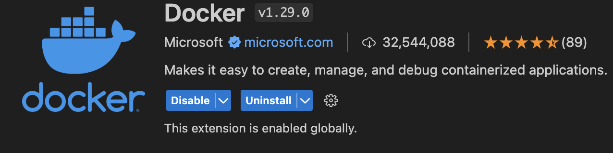

# hadoop-docker-cluster

[bilibili: 给我一首歌的时间，让我配置hadoop docker集群](https://www.bilibili.com/video/BV1vq421w7mn)

## 目录

- [1 - 安装 Docker](#1---安装-docker)
- [2 - 构建 Docker 镜像](#2---构建-docker-镜像)
- [3 - 创建 Docker 网络](#3---创建-docker-网络)
- [4 - 运行 Docker 容器](#4---运行-docker-容器)
- [5 - 快速启动](#5---快速启动)
  - [5.1 - 使用 vscode-docker 插件](#51---使用-vscode-docker-插件)
  - [5.2 - 使用 shell 脚本](#52---使用-shell-脚本)
  - [5.3 - 使用 docker-compose](#53---使用-docker-compose)

<a name='1'></a>
## 1 - 安装 Docker

根据[官方教程](https://docs.docker.com/get-docker/)安装Docker

> 1. Windows在安装Docker时可能遇到各种问题，建议Windows用户在Linux虚拟机中安装Docker
> 2. 在 Linux 中，你需要确保非root用户可以使用Docker CLI，可参考官方教程 [Run the Docker daemon as a non-root user (Rootless mode)](https://docs.docker.com/engine/security/rootless/) 与 [Manage Docker as a non-root user](https://docs.docker.com/engine/install/linux-postinstall/#manage-docker-as-a-non-root-user)

<a name='2'></a>
## 2 - 构建 Docker 镜像

简单来说Docker镜像就是容器模版，我们可以在Docker镜像上创建容器实例，一般我们编写Dockerfile来定制我们自己的Docker镜像，想了解更多请看[ 官方教程 ](https://docs.docker.com/get-started/overview/#images)

``` shell
docker build . -t hadoop # . 为当前目录，你应该保证 Dockerfile 在当前目录下
```

<a name='3'></a>
## 3 - 创建 Docker 网络

我们非常建议创建用户自定义桥接网络，因为在用户自定义桥接网络中容器之间不仅可以通过IP地址进行沟通，还可以通过容器名进行连接，Docker会自动将容器名解析成IP地址，这一功能叫做 [ automatic service discovery ](https://docs.docker.com/network/network-tutorial-standalone/#:~:text=capability%20is%20called-,automatic%20service%20discovery,-.%20Let%27s%20connect%20to)。

``` shell
docker network create hadoop-network # 默认为桥接网络
```

<a name='4'></a>
## 4 - 运行 Docker 容器

一个容器就是可运行的镜像实例, 想了解更多请看[ 官方教程 ](https://docs.docker.com/get-started/overview/#containers)

下面的Docker命令根据hadoop镜像创建了四个容器，以交互的方式(-i)以及附着在终端的方式(-t)运行，并且指定容器hostname(-h)，指定容器名(--name=...), 连接容器到指定网络(--network ...)

``` shell
docker run -it -h master --name=master -p 9870:9870 --network hadoop-network hadoop
docker run -it -h slave1 --name=slave1 --network hadoop-network hadoop
docker run -it -h slave2 --name=slave2 --network hadoop-network hadoop
docker run -it -h slave3 --name=slave3 --network hadoop-network hadoop
```

接着在master容器中运行 `hdfs namenode -format && start-all.sh` 即可

<a name='5'></a>
## 5 - 快速启动

打开四个终端运行`docker run ...`非常的笨重，如果不使用用户自定义网络，那么搭建过程还要更慢，有没有一种更方便快捷的方式搭建hadoop集群呢，下面将介绍。

<a name='5-1'></a>
### 5.1 - 使用 vscode-docker 插件

vscode-docker 插件可以提供非常友好的图形化界面，帮助你更好地管理 docker

<!--  Docker 图片  -->


<!--  vscode-docker 插件演示  -->


<a name='5-2'></a>
### 5.2 - 使用 shell 脚本

一种传统但有效的方式是使用 shell 脚本一次性创建四个容器，需要注意的是docker容器在运行完指定的程序后会立即退出，在Dockerfile中，我们使用 `CMD ["bash", "-c", "service ssh restart; bash"]` 设定容器在启动时打开ssh服务器然后运行bash，如果不以交互式的方式打开，就会因为bash没有输入而立即退出，所以shell脚本应该这样写，-d 表示 detach，`bash -c "service ssh restart && tail -f /dev/null"` 会覆盖Dockerfile中的CMD，`tail -f /dev/null` 是一个可以保证容器一直运行下去的技巧。

``` shell
docker run -d -h slave1 --name=slave1 --network hadoop-network hadoop bash -c "service ssh restart && tail -f /dev/null"
docker run -d -h slave2 --name=slave2 --network hadoop-network hadoop bash -c "service ssh restart && tail -f /dev/null"
docker run -d -h slave3 --name=slave3 --network hadoop-network hadoop bash -c "service ssh restart && tail -f /dev/null"
docker run -d -h master --name=master -p 9870:9870 --network hadoop-network hadoop bash -c "service ssh restart && hdfs namenode -format && start-all.sh && tail -f /dev/null"
```

<a name='5-3'></a>
### 5.3 - 使用 docker-compose

更加现代的方法是使用 `docker-compose`，你可以在仓库中看到`docker-compose.yaml`配置文件，创建集群只需要在命令行中使用`docker-compose up -d` 即可

<!-- vscode-docker 插件演示 -->


<!-- vscode-docker 插件演示 -->

